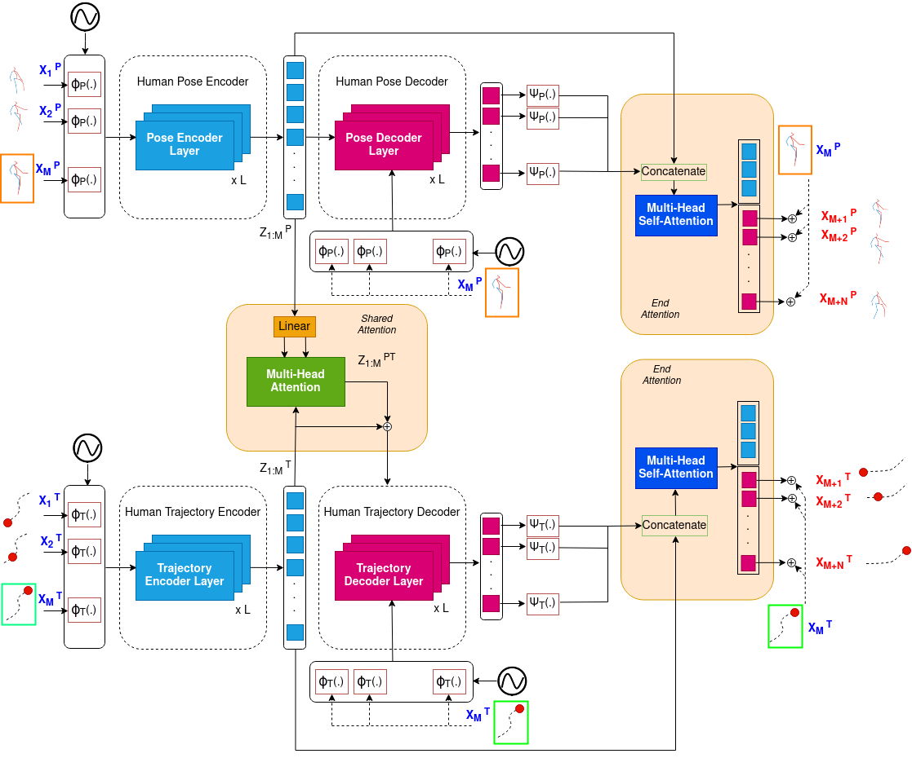

# STPOTR
This is a repository for the paper "STPOTR: Simultaneous Human Trajectory and Pose Prediction Using a Non-Autoregressive Transformer for Robot Following Ahead". It includes the codes for Simultaneous Human Trajectory and Pose Prediction. 



This repository is based on the [potr](https://github.com/idiap/potr) paper
## Installation
```
conda create --name stpotr --file stpotr.yml
conda activate stpotr
pip install numpy
pip install opencv-python
```

You need to download this [data file](https://drive.google.com/file/d/1pNQKtnd1rIl7qPjqIZIJXWDVgisEvabN/view?usp=sharing) and move it to the data folder.

## Testing

We have provided a pretrained model. You can download [this folder](https://drive.google.com/file/d/15eCdRhV1ICyCdAvIAV4DNL9jkdyJUkZ1/view?usp=sharing) and move it to the main repo folder.

You can use this command to run the model.
```
cd model
python testing.py
```
## Training

In order to train the model you can run this command:
```
cd training
python transformer_model_fn.py --model_prefix=./trained_model \
 --batch_size=16 \
--data_path=../data/h3.6m/ \
--learning_rate=0.0001 \
--max_epochs=300 \
--steps_per_epoch=200 \
--loss_fn=mse \
--model_dim=512 \
--model_dim_traj=64 \
--num_encoder_layers=4 \
--num_decoder_layers=4 \
--num_heads=8 \
--dim_ffn=2048 \
--dropout=0.3 \
--lr_step_size=200 \
--gamma=0.1 \
--learning_rate_fn=step \
--pose_format=expmap \
--pose_embedding_type=gcn_enc \
--dataset=h36m_v3 \
--pre_normalization \
--pad_decoder_inputs \
--non_autoregressive \
--pos_enc_alpha=10 \
--pos_enc_beta=500 \
--action=all \
--warmup_epochs=50 \
--weight_decay=0.00001 \
--include_last_obs
```
